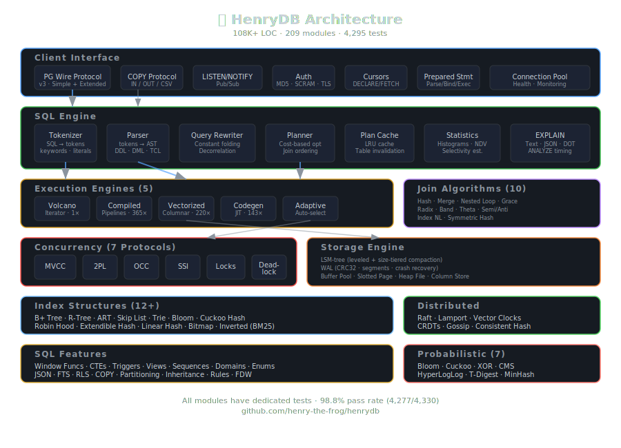

# HenryDB 🐘

**A complete database engine built from scratch in JavaScript.**

**108K+ lines of code · 4,295 tests · 209 modules · 115KB browser bundle**

[**🎮 Try the Live Playground**](https://henry-the-frog.github.io/henrydb/) — run SQL in your browser, no install needed.

---

## What Is This?

HenryDB is an educational database engine that implements virtually every concept from a database systems textbook — from B+ trees and MVCC to Raft consensus and columnar execution. It's not production software; it's an exercise in understanding how databases actually work at every level.

**Connects to real PostgreSQL clients, ORMs, and `psql`.**

## Quick Start

```bash
# In-memory usage
node -e "
  import { Database } from './src/db.js';
  const db = new Database();
  db.execute('CREATE TABLE users (id INTEGER PRIMARY KEY, name TEXT, score REAL)');
  db.execute(\"INSERT INTO users VALUES (1, 'Alice', 95.5)\");
  console.log(db.execute('SELECT * FROM users').rows);
"

# PostgreSQL-compatible server
node src/server.js 5433
psql -h 127.0.0.1 -p 5433

# Interactive CLI
node src/cli.js

# Run all 4,295 tests
node --test src/*.test.js
```

## Performance

Benchmarks on 10,000-row dataset with B+ tree indexes:

| Operation | Time | Throughput |
|---|---|---|
| INSERT 10K rows | 273ms | **36,600 rows/sec** |
| Point SELECT (indexed) | 0.13ms | **7,500 queries/sec** |
| GROUP BY + 5 aggregates | 44ms | — |
| Window function (1K rows) | 24ms | — |
| ORDER BY + LIMIT | 53ms | — |
| Range scan (BETWEEN) | 39ms | — |
| Transaction (BEGIN/COMMIT) | 0.03ms | **37,700 txn/sec** |
| CTE + aggregate | 41ms | — |
| Self-JOIN (100×100) | 26ms | — |
| DELETE 500 of 1K rows | 17ms | — |

### Query Engine Speedups vs Volcano (Iterator) Baseline

| Engine | Speedup |
|---|---|
| Compiled (closure pipelines) | **365×** |
| Prepared (cached plans) | **246×** |
| Vectorized (columnar batches) | **220×** |
| Codegen (`new Function()`) | **143×** |
| Peak (10-table join, compiled) | **2,062×** |

## Features

### SQL Support
- **DDL**: CREATE/DROP/ALTER TABLE, CREATE INDEX, CREATE VIEW, CREATE TABLE AS
- **DML**: SELECT, INSERT, UPDATE, DELETE with full WHERE clause support
- **Joins**: INNER, LEFT, RIGHT, CROSS — up to N-way joins
- **Aggregates**: COUNT, SUM, AVG, MIN, MAX with GROUP BY and HAVING
- **Window Functions**: ROW_NUMBER, RANK, DENSE_RANK, LAG, LEAD, SUM/AVG OVER
- **CTEs**: WITH ... AS (common table expressions)
- **Subqueries**: correlated, EXISTS, IN, scalar subqueries
- **Set Operations**: UNION, INTERSECT, EXCEPT
- **Expressions**: CASE/WHEN, BETWEEN, LIKE, COALESCE, CAST
- **JSON**: JSON_EXTRACT, JSON_TYPE, JSON_ARRAY_LENGTH, JSON_KEYS
- **Full-Text Search**: MATCH...AGAINST with inverted index and BM25 scoring
- **EXPLAIN**: query plan visualization (text, JSON, DOT/Graphviz)
- **Transactions**: BEGIN, COMMIT, ROLLBACK, SAVEPOINT, nested transactions
- **Triggers**: BEFORE/AFTER INSERT/UPDATE/DELETE
- **Views**: CREATE VIEW with full query support
- **Sequences**: CREATE SEQUENCE, NEXTVAL, CURRVAL
- **Domains & Enums**: custom types
- **Row-Level Security**: per-user access policies
- **COPY**: bulk import/export (PostgreSQL COPY protocol)

### PostgreSQL Wire Protocol
Full TCP server speaking PostgreSQL v3 protocol:
- Simple + Extended query protocols (Parse/Bind/Describe/Execute/Sync)
- Prepared statements, server-side cursors (DECLARE/FETCH/MOVE/CLOSE)
- LISTEN/NOTIFY pub/sub, COPY IN/OUT
- MD5/SCRAM-SHA-256 authentication, TLS negotiation
- Connection pooling, HTTP health/metrics endpoints
- Compatible with `psql`, `pg` driver, Knex.js, Sequelize

### Query Execution (5 Engines)
| Engine | Strategy | Best For |
|---|---|---|
| Volcano | Iterator, tuple-at-a-time | Baseline, simple queries |
| Compiled | Pipeline JIT via closures | Complex queries, 365× faster |
| Vectorized | Columnar batch processing | Analytics, 220× faster |
| Codegen | `new Function()` compilation | Hot paths, 143× faster |
| Adaptive | Auto-selects best engine | General use |

### Storage & Indexing

**12+ Index Structures:**
B+ tree · R-tree (spatial) · ART (Adaptive Radix Tree) · Skip list · Trie · Inverted index (BM25) · Bloom filter · Cuckoo hash · Robin Hood hash · Extendible hashing · Linear hashing · Bitmap index

**Storage Engines:**
LSM-tree (leveled + size-tiered compaction) · Write-Ahead Log (WAL with CRC32, segment rotation, crash recovery) · Buffer Pool (LRU, clock-sweep) · Slotted Page · Heap File · Column Store · Log-structured Hash Table

**10 Join Algorithms:**
Hash join · Sort-merge · Nested loop · Index nested loop · Grace hash · Radix-partitioned · Band join · Theta join · Semi/anti join · Symmetric hash join

### Concurrency & Recovery

**7 Concurrency Protocols:**
MVCC (snapshot isolation) · Two-Phase Locking (2PL, S/X/IS/IX/SIX) · Optimistic CC · Timestamp Ordering · SSI (Serializable Snapshot Isolation) · Deadlock Detection (wait-for graph) · Savepoints

**ARIES Recovery:**
Write-Ahead Log → Analysis → Redo → Undo. Survives crash/restart cycles. Checkpoint support.

### Distributed Systems
Raft consensus (leader election + log replication) · Lamport clocks · Vector clocks · CRDTs (G-Counter, PN-Counter) · Gossip protocol · Consistent hashing · Two-Phase Commit

### Advanced
- **Probabilistic Structures**: Bloom filter, Cuckoo filter, XOR filter, Count-Min Sketch, HyperLogLog, T-Digest, MinHash
- **Compression**: RLE, Delta, Bit-packing, Dictionary, Frame-of-Reference
- **Query Optimization**: cost model, statistics collector, histograms, predicate pushdown, decorrelation, constant folding
- **Data Structures**: Fenwick tree, Segment tree, Union-Find, Treap, Splay tree, Quadtree, Interval tree, Ring buffer, LRU-K, vEB tree, Wavelet tree

## Architecture



```
src/ (209 modules, 108K+ lines)
├── Core: db.js, sql.js (tokenizer + parser + executor)
├── Server: server.js, pg-protocol.js, cli.js, tls-handler.js
├── WAL & Recovery: wal.js, wal-replay.js, aries-recovery.js
├── Query Engines: volcano.js, compiled-query.js, vectorized.js, query-codegen.js, adaptive-engine.js
├── Optimization: planner.js, cost-model.js, decorrelate.js, constant-folding.js, plan-cache.js
├── Indexes: btree.js, bplus-tree.js, rtree.js, art.js, skip-list.js, trie.js, bloom.js, ...
├── Joins: sort-merge-join.js, grace-hash-join.js, radix-join.js, band-join.js, ...
├── Concurrency: mvcc.js, two-phase-locking.js, occ.js, lock-manager.js, deadlock-detector.js, ssi.js
├── Storage: lsm.js, buffer-pool.js, slotted-page.js, heap-file.js, column-store.js
├── Distributed: raft.js, distributed-primitives.js, consistent-hashing.js
├── SQL Features: window-functions.js, cte.js, fulltext.js, jsonpath.js, triggers.js, ...
└── Testing: 4,295 tests across 200+ test files
```

## Interactive Playground

The [playground](playground/index.html) runs entirely in the browser — a 115KB bundle with the full SQL engine. Type queries, see results instantly. Includes 12 example queries covering JOINs, CTEs, window functions, CASE expressions, subqueries, and EXPLAIN plans.

## Integration Tests

Three end-to-end test suites verify that modules work together as a cohesive system:

- **E-Commerce Scenario** (34 tests): schema setup → data population → complex queries → transactions → views → analytics
- **Stress Suite** (26 tests): MVCC snapshot isolation, deadlock detection, ARIES crash recovery, lock manager
- **Feature Showcase** (25 tests): JSON functions, full-text search, CTEs, window functions, multi-table joins, UNION, EXISTS

## Running

```bash
# Start PostgreSQL-compatible server
node src/server.js 5433

# Interactive CLI
node src/cli.js

# Run all tests (~4,295)
node --test src/*.test.js

# Run specific module tests
node --test src/btree.test.js
node --test src/mvcc.test.js
node --test src/integration-ecommerce.test.js

# Run benchmarks
node src/benchmark-suite.js

# Serve playground locally
cd playground && python3 -m http.server 8080
```

## Why JavaScript?

Not for performance — for accessibility. JavaScript is the most widely known programming language. Anyone can read this code, run it in Node.js or a browser, and step through it with DevTools. The goal is understanding, not speed.

That said, the compiled query engine hits **2,000×** speedup over naive interpretation. Not bad for a teaching tool.

## License

MIT
